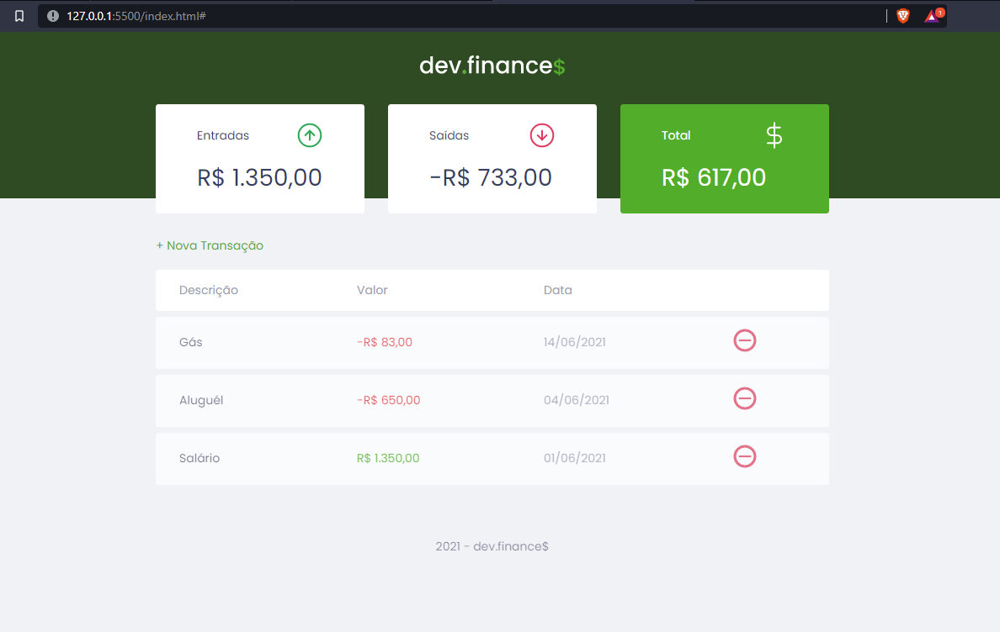

<h1 align="center">
  
</h1>


<p align="center">
  
</p>

## 🧰 Technologies
---

This project was developed with the following technologies:

- HTML
- CSS
- JavaScript

## 💻 Project
---

Dev.finances is a financial control application, where you can register and delete transactions and see the input and output balance 💰


### 👀 Prerequisites
---

Before starting, you will need to have the following tools installed on your machine:<br/>
[Git](https://git-scm.com) and a code editor like [VSCode](https://code.visualstudio.com/).

### 👨‍💻 Running the Project
---

```bash
# Clone este repositório
$ git clone <https://github.com/Arthur-Ferreira/Dev.Finances-Maratona-Discover>

# Acesse a pasta do projeto no terminal/cmd
$ cd dev_finances

# Abra o arquivo html no navegador
$ start .\index.html
```

## 🔖 Layout

Você pode visualizar o layout do projeto através [desse link](https://www.figma.com/file/7Vu9DzUaCZIV4nibzkjgB4/dev.finance%24-Maratona-Discover). É necessário ter conta no [Figma](https://figma.com) para acessá-lo.


---
<p align="center">
Feito com 🖤 by ARTHUR FERREIRA on the Rocketseat - Maratona Discover 1
</p>